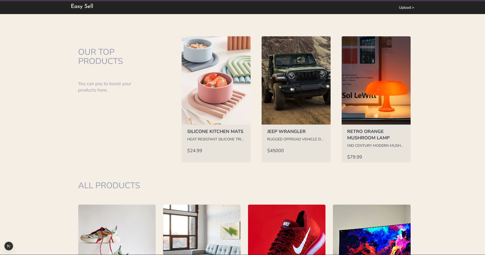
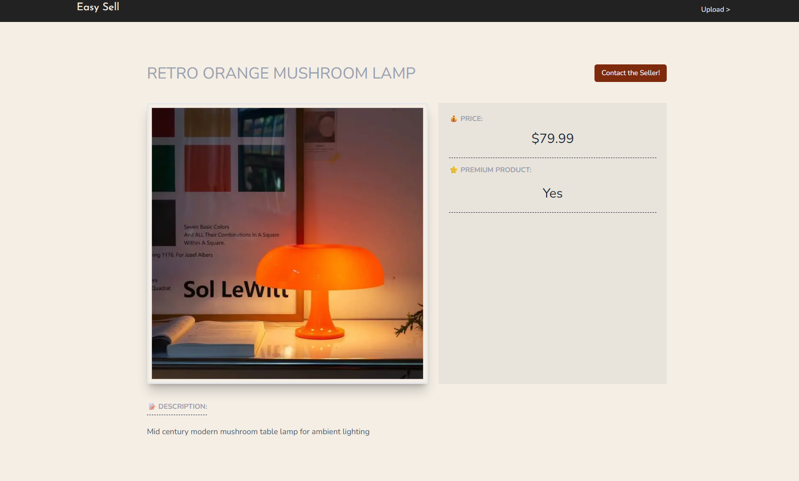
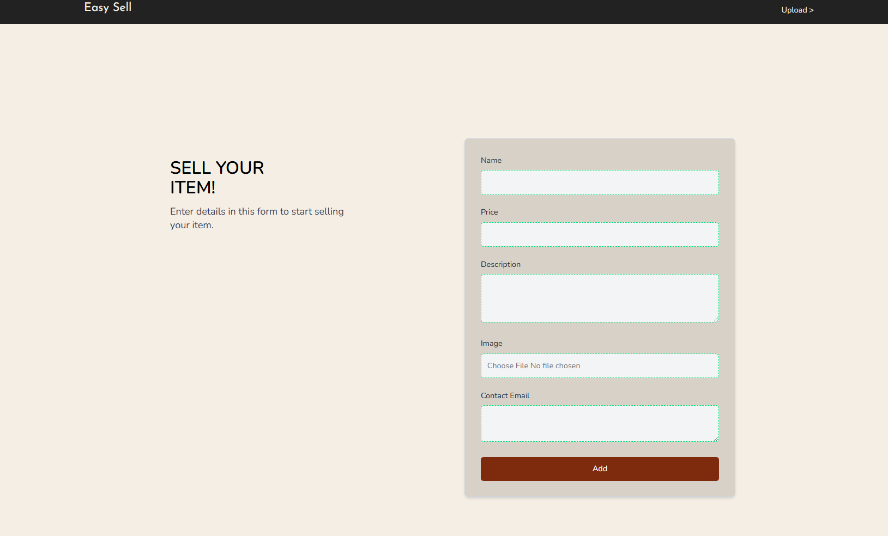

# Easy Sell

Easy Sell is a product listing website built with Next.js, React, Tailwind CSS, and Supabase. It lets users browse products, open individual product pages, and upload new items with an image, price, description, and seller contact email.

## Preview

Add screenshots later by placing images in `public/readme/` and updating these paths.





If you do not want broken image previews in GitHub until you add screenshots, replace the section above with plain text placeholders:

- `public/readme/home-page.png`
- `public/readme/product-page.png`
- `public/readme/upload-page.png`

## Features

- Browse all products from Supabase
- Highlight boosted products on the home page
- Open static product detail pages by slug
- Upload a new product with image validation
- Store product images in Supabase Storage
- Product-level SEO metadata and Open Graph tags
- Upload-page route metadata via nested layout

## Tech Stack

- Next.js 16
- React 19
- TypeScript
- Tailwind CSS 4
- Supabase
- Zod

## Project Structure

```text
app/
  layout.tsx
  page.tsx
  products/
    [slug]/page.tsx
    upload/
      layout.tsx
      page.tsx
actions/
  index.ts
components/
  card.tsx
  footer.tsx
  header.tsx
  submit-button.tsx
supabase/
  client.ts
  server.ts
utils/
  index.ts
```

## Routes

- `/`
  Home page with boosted products and all product listings
- `/products/[slug]`
  Product detail page with SEO and Open Graph metadata
- `/products/upload`
  Client-side form page for adding a product

## How It Works

### Product listing

The home page fetches products from the `easysell-products` table and renders them through the card component.

### Product detail pages

Each product page is generated from the product `id` and uses route metadata based on the current product's name, description, and image.

### Image handling

Uploaded images are stored in the Supabase bucket named `storage`. The app normalizes both stored file paths and full Supabase image URLs through the shared helper in `utils/index.ts`.

### Upload flow

The upload form submits to a Server Action in `actions/index.ts`. The action:

- validates fields with Zod
- uploads the image to Supabase Storage
- inserts the product row into `easysell-products`
- revalidates `/`
- redirects back to the home page

## Environment Variables

Create a `.env.local` file in the project root:

```env
NEXT_PUBLIC_SUPABASE_URL=your_supabase_project_url
NEXT_PUBLIC_SUPABASE_ANON_KEY=your_supabase_anon_key
```

## Supabase Requirements

You need:

- a Supabase project
- a table named `easysell-products`
- a public storage bucket named `storage`

Suggested columns for `easysell-products`:

```sql
id uuid primary key
name text
description text
price text
imageUrl text
contactEmail text
boost boolean
```

If your `id` is generated automatically, make sure Supabase is configured to do that.

## Getting Started

Install dependencies:

```bash
npm install
```

Run the development server:

```bash
npm run dev
```

Open `http://localhost:3000`.

## Available Scripts

```bash
npm run dev
npm run build
npm run start
npm run lint
```

## Notes

- `next.config.ts` allows remote images from your Supabase domain.
- Server Actions are configured with an `8mb` body size limit.
- The upload form also performs its own file validation in `actions/index.ts`.

## Deployment

This app can be deployed on Vercel or any platform that supports Next.js App Router projects.

Before deploying, make sure:

- environment variables are set
- the Supabase storage bucket is public if you want public image URLs
- the remote image domain in `next.config.ts` matches your Supabase project URL

## Future Improvements

- add authentication for sellers
- add edit and delete product flows
- add pagination or filtering
- add image compression before upload
- add better product schema typing

## License

Use your preferred license here.
